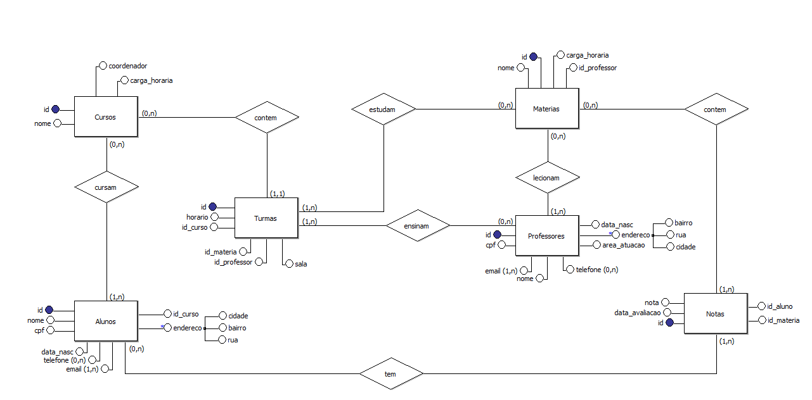

# Database Faculdade
Esse repositorio tem como objetivo apresentar minha atividade da faculdade que consiste na modelagem de um banco da dados de uma faculdade a partir do seguinte estudo de caso:

"Os proprietários de uma faculdade precisam de um sistema que viabilize o armazenamento de informações sobre seus alunos, cursos,matérias professores para que seja possível realizar controles básicos como montar turmas e realizar o armazenamento dos alunos."

## O que você vai encontrar

* Levantamento de Requisitos
* Modelo Conceitual
* Modelo Lógico
* Modelo Físico

# Levantamento de requisitos
1. Quais são as principais necessidades dos clientes?

    * Resposta: Os proprietários de uma faculdade precisam de um sistema para armazenar informações sobre alunos, cursos, matérias e professores, permitindo controlar turmas e notas dos alunos.

2. Quais informações precisam ser armazenadas?
    * Resposta: Informações que precisam ser armazenadas são dos alunos, cursos, matérias, professores, turmas e notas dos alunos.

3. Dados que precisam ser guardados?
    * Resposta: Alunos: Nome, CPF, data de nascimento, endereço, telefone, e-mail e curso. Cursos: nome do curso, carga horária e  coordenador. Matérias: nome da matéria, carga horária e professor responsável. Professores: nome, CPF, data de nascimento, área de atuação, endereço, telefone e e-mail. Turmas: curso, matéria, professor, horário e sala. Notas: aluno, matéria, nota, data da avaliação.

4. O que será feito com os dados posteriormente?
    * Resposta: Controle de turmas, armazenamento de notas, consulta de informações de alunos, cursos, matérias e professores. Relatórios e análises acadêmicas.

5. Quais tabelas precisam ser criadas para que todas as informações sejam armazenadas?
    * Resposta: tabela de alunos, tabela de cursos, tabela das matérias, tabela dos professores, tabela das turno e tabela das notas.

6.  Quais atributos cada tabela deve ter?
    * Resposta: Tabela de alunos: id, nome, cpf, data_nasc, endereco, telefone, email, curso_id. Tabela de cursos: id, nome, carga_horaria, coordenador. Tabela de matérias: id, nome, carga_horaria, professor_id. Tabela de professores: id,  nome, cpf , data_nasc, area_atuacao, endereco, telefone, email. Tabela de turmas: id, curso_id, materia_id, professor_id, horario, sala. Tabela de notas: id, aluno_id, materia_id, nota, data_avaliacao.

7. Qual tipo de dados de cada atributo definido?
    * Resposta: id (INT, PRIMARY KEY, AUTO_INCREMENT), nome (TEXT), CPF (VARCHAR(20), UNIQUE), data_nasc (DATE), endereco (NOVA TABELA), telefone (NOVA TABELA), email (TEXT), curso_id (INT, FOREIGN KEY), carga_horaria (TIME), coordenador (TEXT), professor_id (INT, FOREIGN KEY), area_atuacao (VARCHAR(45)), curso_id (INT, FOREIGN KEY), materia_id (INT, FOREIGN KEY), horario (TIME), sala (VARCHAR(20)), aluno_id (INT, FOREIGN KEY), nota (FLOAT)), data_avaliacao (DATE), 

8. Quais são os relacionamentos a serem criados entre as tabelas?
    * Resposta: A Tabela de alunos vai ter uma relação de muitos para um com tabela de cursos. A tabela de matérias vai ter uma relação de muitos para um com a tabela de professores. A tabela de turmas vai ter relações de um para um com a tabela de cursos, um para muitos com a tabela de matérias e tabela de professores. A tabela de notas vai ter relações de um para muitos com tabela de alunos e tabela de matérias.
  
## Modelo Conceitual

## Modelo Lógico

